# PPanG: a precision pangenome browser enabling nucleotide-level analysis of genomic variations in individual genomes and their graph-based pangenome

PPanG is a precision genome browser with a new perspective of pangenome. Existing pangenome browsers focus on the variations
of nucleotide sequences, including base mutations and structural variations. However, pangenomic studies of the variations
at gene level (presense/absense variations (PAV) and gene structural variations (gSV)) just stay on statistics, and the 
details of variation still remains unknown. PPanG provides te nucleotide-accurate visualization of both genome sequences and
genome annotations, making it clear to analyze the genomic variations from the nucleotide level to gene level.

PPanG is composed of two subviews: graph view for the whole pangenome in SequenceTubeMap and linear view for each individual genome in JBrowse2. 
PPanG is easy to get started, but requires efforts to interpret the visualizations, as the visualizations are mixture of different
views (graph & linear views) and different tracks (sequence & annotation tracks). So it is strongly recommended to understand
the principles of PPanG first. The introduction page is https://cgm.sjtu.edu.cn/PPanG/.

## User Guide

PPanG is divided into three areas: `Navigation Area`, `Visualization Area` and `Functional Area`, and sd-1 gene region is visualized by default:
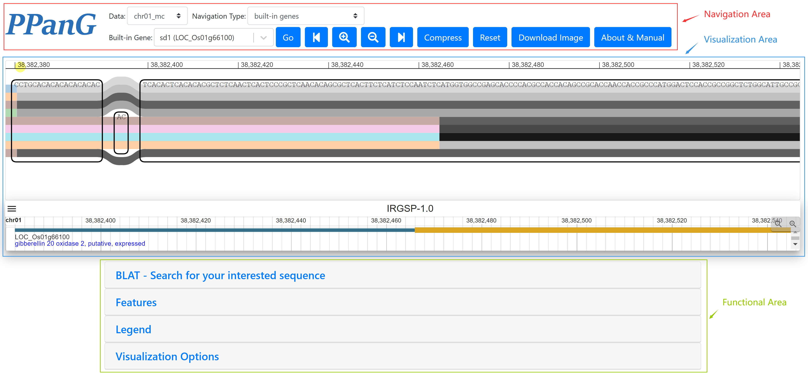
Next we will explain these three areas in details.

### Navigation Area
Navigation Area allows users to provide the custom region for visualization besides the default sd-1 gene region. The 
navigation is very simple within three steps:
1. Select the target chromosome at "Data". Pangenome graphs built by both MC and PGGB are available for users to choose.
2. Select the navigation type. There are three navigation types available:
   a) `Navigation Type=built-in genes`

   Just select from the built-in genes. e.g.The navigation of `GS5` on chr05:
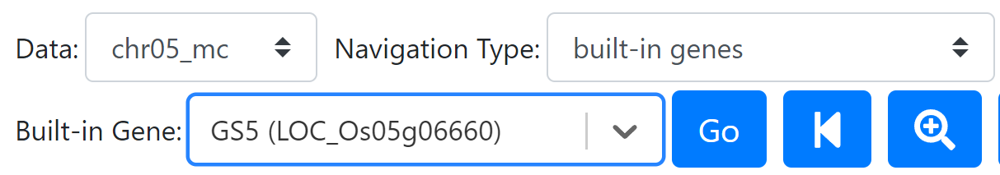
   b) `Navigation Type=reference annotation gene ID`

   Input the target MSU RGAP7 gene ID and select the gene ID from the list. e.g. The navigation of `LOC_Os08g03060` on chr08:
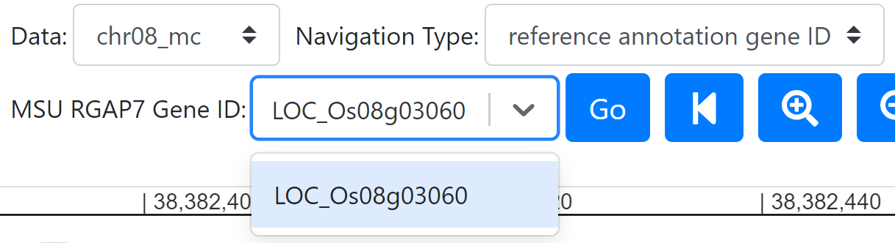
   c) `Navigation Type=custom region`

   Input the target region by coordinates. Format: `<sample name.chrxx>:<start coordinate>-<end coordinate>`. In this step
any individual can be selected as reference. The "Custom Path" box provides the list of available paths. Type and select the path name (related samples will be suggested if typing into the box), and 
"Region" is automatically filled with the selected path name. e.g. The navigation of `CHAOMEO.chr11:6541923-6546025`:
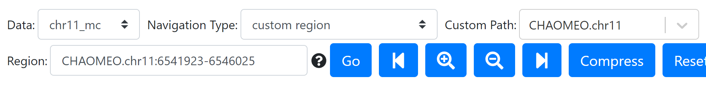
3. Click the "Go" button and wait a minute for loading. The visualization of `Visualization Area` will be updated.

There are several functional buttons beside "Go":
- Left: Shift the target region to `(start - offset, end - offset)`. `offset` is half the length of target region.
- Zoom in: Double the scaling of visualization in graph view.
- Zoom out: Half the scaling of visualization in graph view.
- Right: Shift the target region to `(start + offset, end + offset)`. `offset` is half the length of target region.
- Compress: Compress the visualization of graph view within the width of the window. This function may be useful because the 
whole pangenome graph can be too long to observe.
- Reset: Reset the translation/zoom scaling to default in graph view.
- Download Image: Download the visualization composed of graph view and linear views. Note that this function is not
suitable for large graphs. For this use case, see `FAQ` for more details.
- About & Manual: Navigate to PPanG homepage.

### Visualization Area
The visualization of PPanG is composed of SequenceTubeMap graph view and JBrowse2 linear views. For interpretation of PPanG
visualization, please refer to the PPanG homepage: https://cgm.sjtu.edu.cn/PPanG/. The custom options for visualization is
available at `Functional Area`.
#### Graph View in SequenceTubeMap
In the graph view, the pangenome graph of nine representative genomes are visualized by default. The graph is ultra long
because each nucleotide is visualized, and the graph can be translated by mouse-dragging, zoomed by mouse-scrolling and compressed by 
clicking the "Compress" button at `Navigation Area`.

##### Zoom Behavior
The zoom behavior of "Zoom" button at `Navigation Area` and mouse-scrolling is different, because sometimes the zoom is only required at 
horizontal direction (compress the graph):
- For "Zoom" button: It is equivalent to normal zoom scaling.
- For mouse-scrolling: If horizontal zoom scaling < 1.0, the zoom only works horizontally. That is to
compress/uncompress the graph. If horizontal zoom scaling > 1.0, the zoom works both horizontally and vertically. That is
equivalent to normal zoom scaling.

#### Coordinates
Above the graph is the coordinate axis of the reference (not necessarily the reference genome, but the reference selected in the target region).
In SequenceTubeMap, the coordinate axis may be longer than the target region, and the actual start and end coordinates are 
marked in yellow circles. For example, in the figure below, the yellow circle represents the start coordinate 6,541,923:
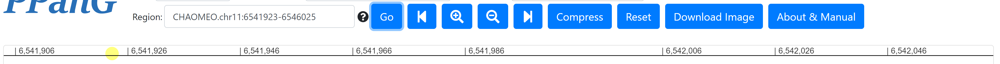

#### Linear View in JBrowse2
By default, the linear view of reference is visible below the graph view. Linear views for other individuals are simply added
by double-clicking the paths in graph view. The usage of linear view is the same as native JBrowse2 component. The document of
JBrowse2: https://www.jbrowse.org/jb2/docs/.

#### Combination of Graph View and Linear View
In PPanG, the graph view and linear views are combined in parallel. The connection among different views are shared coordinates.
Different linear views are all aligned to the graph view according to start coordinate of the reference. Besides, the coordinate change
in graph view will trigger synchronous changes in linear views (The opposite is unavailable, because the linear views are free to extend
outside the target region while the graph view is not). Consequently, exons at the same position from different views represents the same exon. 
Note that the coordinate alignment cannot be exactly perfect, because the coordinates of graph view are not uniformly distributed with occasional variations.

### Functional Area
Functional Area contains several additional features helpful to users:

#### BLAT server
As the list of reference gene IDs is available in PPanG, it is easy to navigate to the known gene region. But it does not
work for novel sequences, including distributed genes absent in reference genome but present in other genomes. Therefore, 
a BLAT server is embedded in PPanG, which helps the locating of novel sequences. Input the target sequence and click the
"Search" button, the BLAT server will automatically process the alignment result and provide the target region. By default,
the novel sequence is searched within the nine reference genomes, and the search range can be expanded to all individuals by selecting
the "Search all genomes".
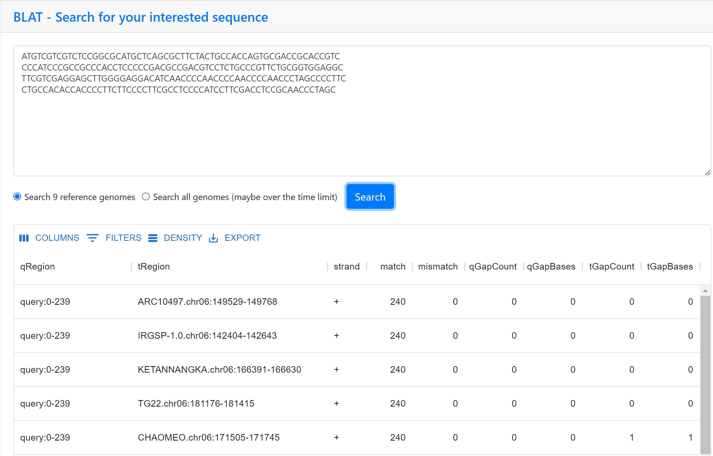
Then input the "tRegion" of BLAT result as `Navigation Type=custom region` in 2c to visualize the custom region in PPanG.

#### Annotation Data 
The "Annotation Data" tab collects genome annotations within the target region. Click the "Download All" button to download
these annotation data for each individual.

#### Legend
The legends of all aligned genome tracks in graph view are shown in this tab. By default, the nine reference genomes are selected 
to show, and users are available to select any individual to add it in the pangenome graph. To visualize all individuals, 
please click the "Select all" and wait a moment. The large pangenome graph may cost much time and memory.

#### Visualization Options
There are some options to adjust the visualization in PPanG.

For SequenceTubeMap view:
- Hide nucleotide bases: Hide the text of nucleotide bases for simplicity.
- Fully transparent nodes: Turn the nodes transparent. Otherwise, the nodes are covered with gray masks.
- Show exons on genome tracks: Visualize the exons on genome tracks. Otherwise, only genome tracks are visualized.
- Select genes of no interest to hide: Hide exons from the selected transcripts. It is useful when different transcripts overlap and
cannot be distinguished.
- Colors: By default, the genome tracks are colored in pale colors and exons are colored in grayscale. Users are available to select
the color options to their preferences.

For JBrowse2 views:
- Rearrange linear views: Reorder or remove the linear views for better visualization.

Other options for JBrowse2 are available by clicking the button in the top-left corner of each linear view.

## Example for visualiztion of Xa7
This section we will describe the whole user path for visualization of the distributed gene Xa7.

Xa7 is known to be absent in the reference genome, so the `Navigation Type=reference annotation gene ID` is unable for 
navigation. Then, the BLAT server is necessary to locate the Xa7 region. The Xa7 sequence is input into the BLAT server to
find the target "tRegion":
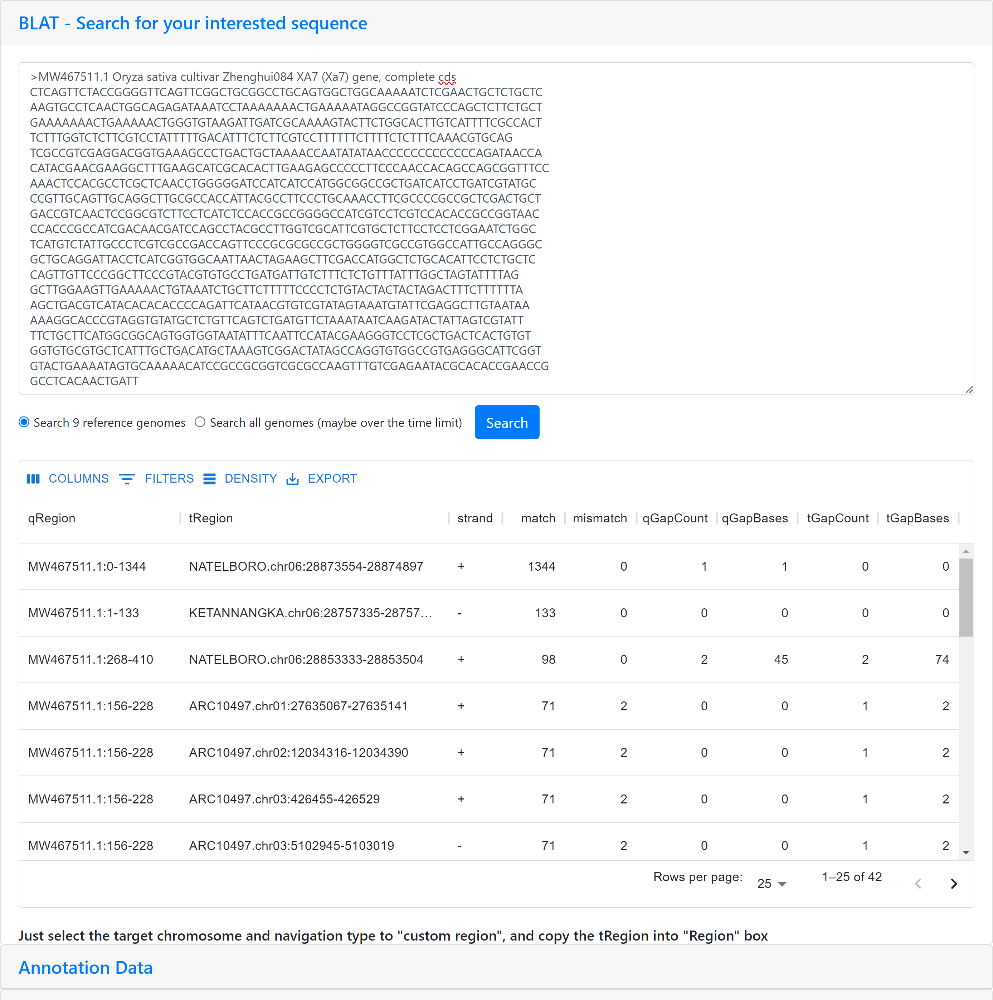
As the BLAT result shows, there is only one match with the "tRegion" of `NATELBORO.chr06:28873554-28874897`. Then the region
is provided in the `Navigation Area` step 2c:
- Select "chr06_mc" at "Data";
- Select "custom region" at "Navigation Type" and copy the tRegion `NATELBORO.chr06:28873554-28874897` into "Region";
- Click the "Go" button.

The visualization is shown below:
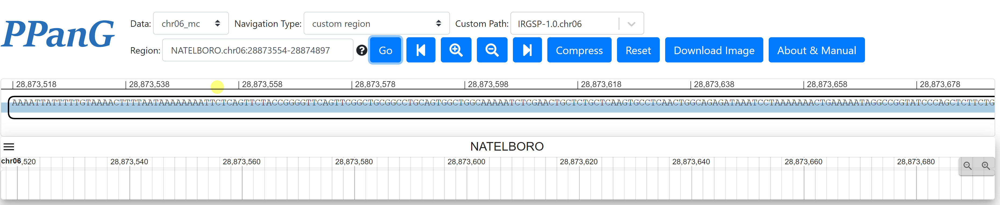
As this figure shows, only one track is visible for nine reference genomes. That is, Xa7 sequence is only present in one 
genome and absent in the other eight genomes. All aligned tracks are listed in the "Legend" tab:
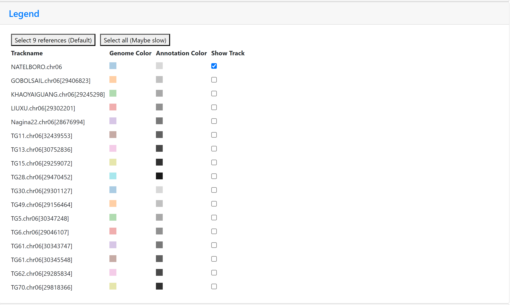
Click the "Select all" button to visualize all individuals and click the "Compress" button at `Navigation Area` for a global overview.
Double click some of the paths in graph view to add them into linear views. The final visualization is as follows:
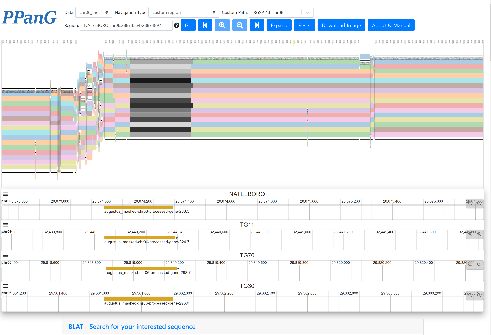

## Run PPanG for your own data

- ### Install
clone the repo and install dependencies:
  ```shell
  git clone git@github.com:SJTU-CGM/PPanG.git
  cd PPanG/
  npm install # or yarn install
  ```
  tabix (https://github.com/samtools/tabix) and vg (https://github.com/vgteam/vg) are also needed in your `PATH`.
- ### Configurations for SequenceTubeMap

  The configuration of SequenceTubeMap view is in `src/config.json`, `dataPath` should be set to your own data folder (
  in PPanG `dataPath` is `riceData/`) and `DATA_SOURCES` correspond to the xg files in your `dataPath`. The reference is
  set in `reference`. The `name`, `alias` and `annotation` of `reference` can be the same. `bedFile` is only available
  if vg chunks are pre-processed, otherwise it should be removed. Other detailed configuration is available in
  SequenceTubeMap.
- ### Configuration for JBrowse2
  All genomes and GFF3 annotations are needed in bgzip format (*.fasta.gz, *.fasta.gz.gzi, *.fasta.gz.fai, *.gff.gz, *
.gff.gz.tbi) in `jbrowse/` folder.
- ### Notes for BLAT server
  Unfortunately, the total size of all 113 genomes in PPanG are over the max limit of the BLAT server. So indeed, these genomes are divided into 11 
parts of database. The BLAT server searches part1 (for nine references) or all parts (for all genomes) for the query sequence and collects 
the results together. That explains why searching all genomes may exceed the time limit. We do not recommend deploying the BLAT server as PPanG does. 
For novel sequences, just use sequence alignment tool like BLAST at user's local machine is enough and ignore the BLAT server.
- ### Other Configurations for PPanG
  `builtin_genes.json` and `reference_genes.json` are required in `src/` folder. The format is
  ```json
  {
    "<data.xg>": {
      "<gene_id>": "<gene_region>",
      ...
    },
    ...
  }
  ```
  For example, the `builtin_genes.json` in PPanG is like:
  ```json
  {
    "chr01_mc.xg": {
      "sd1 (LOC_Os01g66100)": "IRGSP-1.0.chr01:38382381-38385503",
      "Pish (LOC_Os01g57340)": "IRGSP-1.0.chr01:33141126-33145608",
      "Gn1a (LOC_Os01g10110)": "IRGSP-1.0.chr01:5270102-5275677"
    },
    "chr02_mc.xg": {
      "tgw2 (LOC_Os02g52550)": "IRGSP-1.0.chr02:32155212-32156481",
      "GW2 (LOC_Os02g14720)": "IRGSP-1.0.chr02:8114960-8121924",
      "OsGL1-4 (LOC_Os02g40784)": "IRGSP-1.0.chr02:24718046-24724119",
      "tms5 (LOC_Os02g12290)": "IRGSP-1.0.chr02:6397341-6399235",
      "EP3 (LOC_Os02g15950)": "IRGSP-1.0.chr02:9042075-9046140",
      "RSS1 (LOC_Os02g39390)": "IRGSP-1.0.chr02:23769389-23772841",
      "OsSKIPa (LOC_Os02g52250)": "IRGSP-1.0.chr02:31995217-31997696"
    },
    ...
  }
  ```

## FAQ

### Q: Why sometimes the linear view reports the bug like "failed to fetch data, reload"?
A: This bug occurs possibly due to the network failure. Click the "reload" button will solve the problem.
### Q: How to download the large pangenome graph?
A: The library used by "Download Image" button is designed for daily use, when users hardly need to download a so large graph.
It is not suitable for the large pangenome data. As an alternative, we recommend a better way to download the large graph with
a native tool in the Edge/Chrome browser. Press `F12` to open the developer tools. Select the "Elements" tab, click the `<div id="root">`,
and click the `<div>` below. Then, right-click the `<div id="Pangenome browser">...</div>` and select `Capture node screenshot`.
Then the browser will automatically download the large graph into `xx.png`.
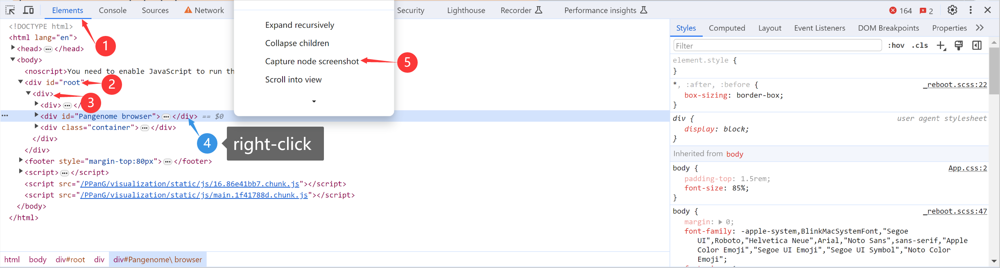
### Q: Is it unavailable to search all genomes in the BLAT server if it exceeds the time limit?
A: Actually, the BLAT server uses caches to store the alignment results. Although one request exceeds the time limit, the
caches are still saved in the server. If the same request comes, the BLAT server will use cashes to avoid redundant calculations.
So it is feasible to click the "Search" button again and again until success.
### Q: Why one genome has more than one paths in some regions in the graph view?
A: From the perspective of the whole pangenome graph, one genome should correspond to only one path exactly. But in a 
directed cyclic graph, one path may be truncated into different pieces within a target region. We show a simple demo in 
the figure below:
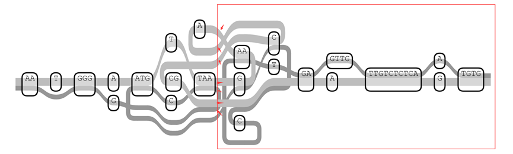
There are totally two paths in this graph. However, if the right part of this graph is extracted as marked in the figure, 
there will be many broken lines in the subgraph. Actually, how to extract a pretty subgraph from the original graph is 
also a challenge to pangenome graph algorithms.
  
