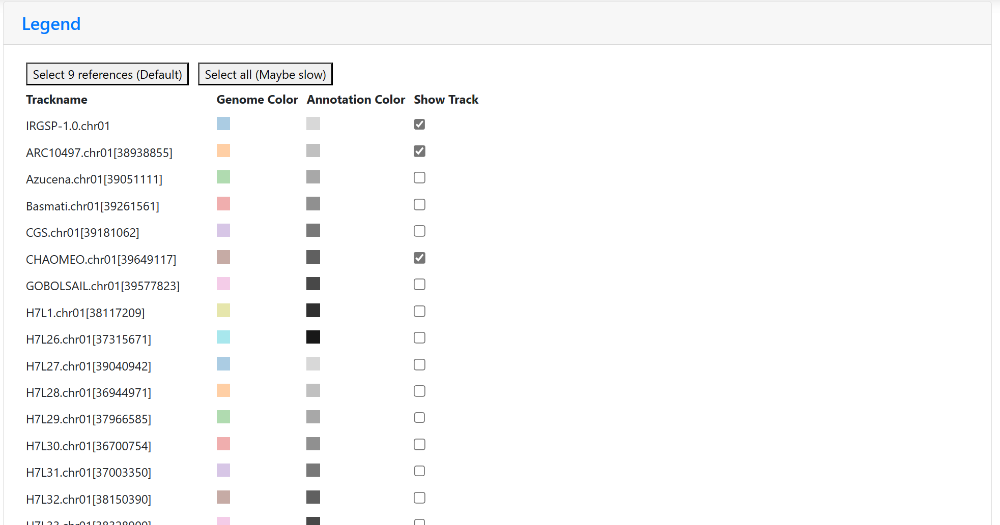
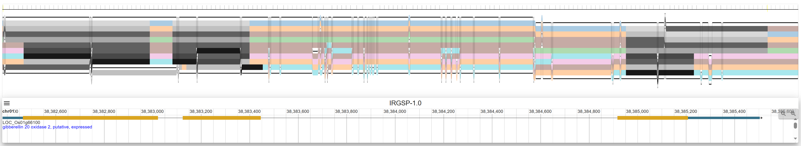
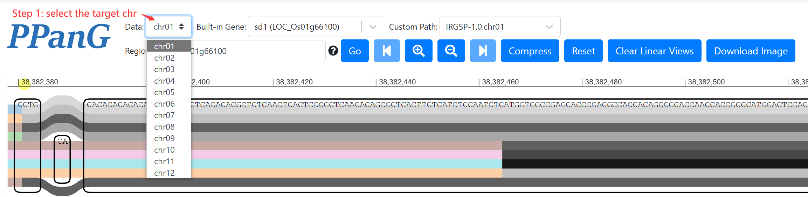
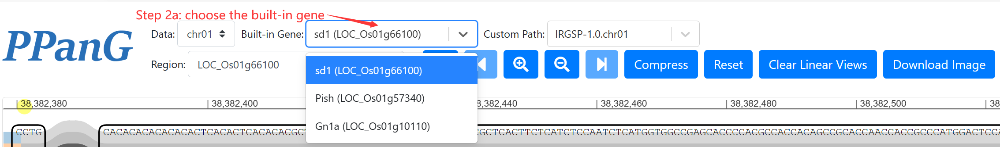
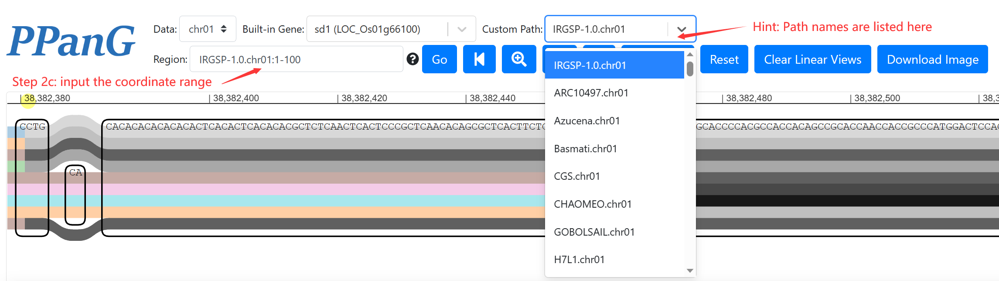
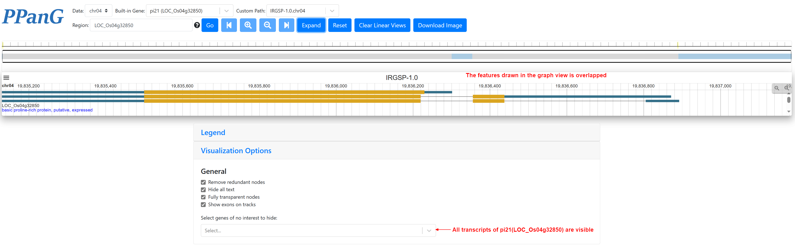
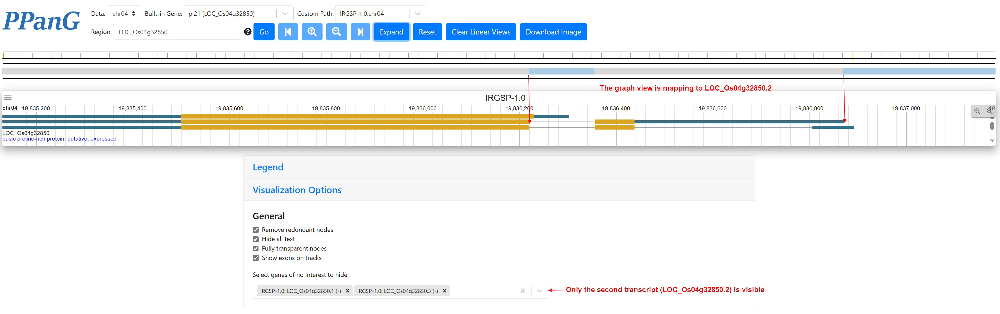
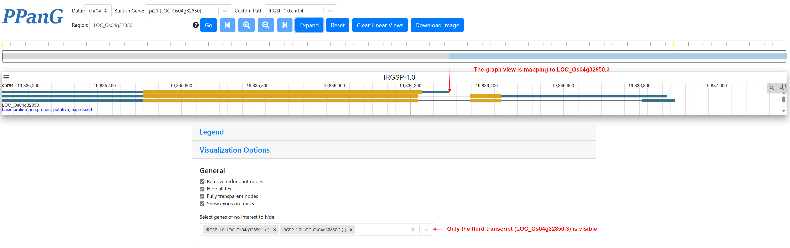

# PPanG: a precise pangenome browser combining linear and graph-based pan-genomes

## 1. Introduction

As a single reference genome cannot represent the whole genomic diversity, pangenome is gradually accepted to cover the
genetic information in all individuals for a species. Currently, graph-based pangenome is gradually gaining
popularity than linear pangenome because the graph model stores more comprehensive information of variations, including
the locations and structures. However, the graph-based pangenome browser is only designed for multiple sequence
alignment, and it is unavailable to visualize multiple genome annotations simultaneously.

Here we report a new pangenome browser called PPanG, precise pangenome browser combining linear and graph-based
pangenome. We used rice pangenome as an example to show it.

The PPanG homepage is https://cgm.sjtu.edu.cn/PPanG/.

## 2. User guide

PPanG is implemented by SequenceTubeMap and JBrowse2, and we modify the functions and add new many features for
visualize precise pangenome annotation. Nine rice genomes with high quality sequences and annotations are provided by
default as the potential reference genomes, and all individual genomes can be selected as the reference.

- By default, sd-1 gene is shown for 9 representative genomes, and other genome tracks are available at "Legend".
  
- In the pangenome graph view, genome tracks are drawn in color and exons from genome annotation are drawn in grey over
  them.
- In the linear genome view, IRGSP-1.0 is visible by default and other genomes will be added by double-clicking the
  genome track in the graph view.
  
- The mapping between the graph view and linear view and interpretation is available on the homepage.

PPanG is also designed to be user-friendly and easy to use for other regions of interest. Only the following two steps
are needed:

#### 1. Select the target chromosome at “Data”:



#### 2. Provide the target region in “Region” and click the “Go” button.

There are three ways to specify the target region:

2a. Simply select the gene from “Built-in Gene” if anyone is the gene of interest:

2b. Input the MSU7 gene ID into “Region” (e.g. “LOC_Os01g66200”) if the gene of interest is annotated by MSU7, and
the browser will turn to the target region of this gene automatically:

2c. Select the path and input the coordinate range into “Region” (e.g. “IRGSP-1.0.chr01:1-100”) or a start position
and a distance (e.g. “IRGSP-1.0.chr01:1+100”) to specify any custom region. <b> Any sample can be considered as the
reference in this step.</b>


<b> Note: Occasionally, if a gene overlaps with an adjacent gene in this region, elements of both genes will be drawn in
gray and cannot be distinguished. In this case, it is needed to select the genes of no interest to hide them:</b>





## 3. Run PPanG for your own data

- #### clone the repo and install dependencies:
  ```shell
  git clone git@github.com:SJTU-CGM/PPanG.git
  cd PPanG/
  npm install # or yarn install
  ```
  tabix is also needed in your `PATH`, it can be installed by `sudo apt install tabix` or source code.
- #### configurations for pangenome graph

  The configuration of SequenceTubeMap view is in `src/config.json`, `dataPath` should be set to your own data folder (
  in PPanG `dataPath` is `riceData/`) and `DATA_SOURCES` correspond to the xg files in your `dataPath`. The reference is
  set in `reference` (`alias` and `annotation` just remain the same to `name` if no alias). `bedFile` is only available
  if vg chunks are pre-processed, otherwise it should be removed. Other detailed configuration is available in
  SequenceTubeMap.

- #### configuration for precise annotation visualization

  All genomes and GFF3 annotations are needed in bgzip format (*.fasta.gz, *.fasta.gz.gzi, *.fasta.gz.fai, *.gff.gz, *
  .gff.gz.tbi) in `jbrowse/` folder. 


  

  
